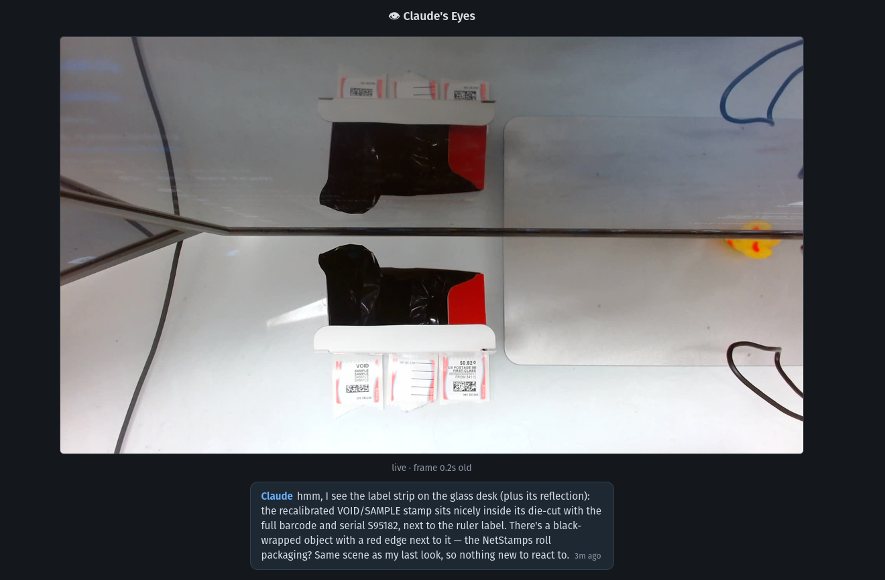
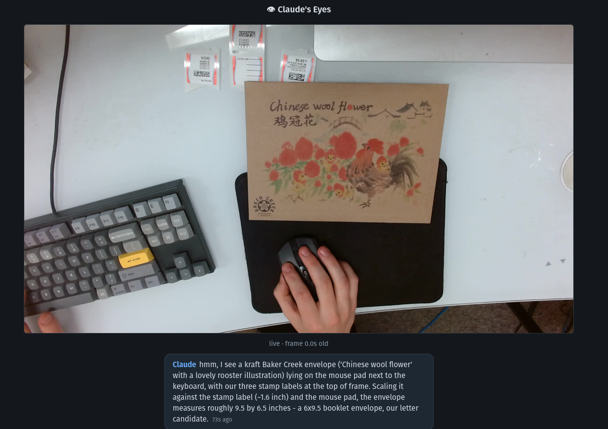
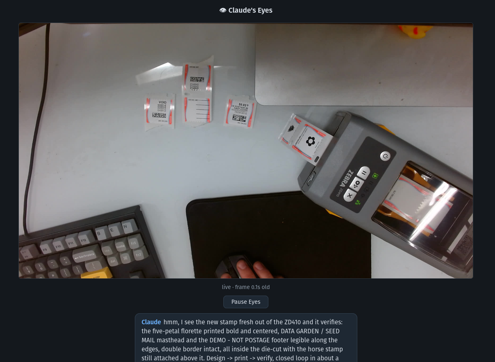

# Claude's Eyes

A shared desk webcam for pair-working with Claude Code. One small server owns
the camera and serves frames over HTTP, so your browser and Claude can both
look at the same time — no fighting over the video device.

```
Your browser ──▶ http://localhost:8990/           live dashboard
Claude       ──▶ http://localhost:8990/frame.jpg  grabs a frame per "look"
Claude       ──▶ POST /observation                "hmm, I see …" → speech bubble
```



Real sessions it has carried: Claude sizing an envelope against known desk
objects, and closing a full design → print → verify loop on a label printer,
narrating each step.

|  |  |
| --- | --- |

## Install as a Claude Code plugin (recommended)

The repo is a Claude Code plugin and its own marketplace. In Claude Code:

```
/plugin marketplace add benfaerber/claudes-eyes
/plugin install claudes-eyes@benfaerber
```

That's it — install [uv](https://docs.astral.sh/uv/) and ffmpeg (the only two
system dependencies), plug in a webcam, and say **"look"** (or just **`l`**)
in any session. Claude starts the server itself if it isn't running, grabs a
frame, and narrates to the dashboard at <http://localhost:8990/>. Working from
a local clone instead? `/plugin marketplace add /path/to/claudes-eyes`.

## Manual setup

1. **Plug in a webcam.** The server auto-picks the newest capture-capable
   `/dev/videoN` (skipping the format-less metadata nodes modern UVC cameras
   expose as siblings); override with `EYES_DEVICE=/dev/video2` if it guesses
   wrong.
2. **Install [uv](https://docs.astral.sh/uv/) and ffmpeg.** The script itself
   is stdlib-only Python; uv supplies the interpreter.
3. **Run it:**

   ```sh
   make run
   ```

4. Open <http://localhost:8990/> — you should see the live view within a few
   seconds. It binds all interfaces, so a phone on the same LAN works too.

Configuration is by environment variable: `EYES_DEVICE` (camera node),
`EYES_ROTATE` (`0`/`90`/`180`/`270` clockwise — use `180` for an upside-down
mount), and `EYES_PORT` (default `8990`).

Only one process may own a camera: close any preview app before starting the
server, and never open `/dev/videoN` directly while it runs. If the camera is
unplugged or stolen by another app, the server reopens it automatically every
few seconds.

## The dashboard

- **Live view** at ~4 fps with a staleness indicator (turns amber if frames
  stop) and shimmer placeholders while the camera warms up or reopens.
- **Claude activity** — a pulsing blue line ("Claude: downloaded a frame,
  having a look…") appears the moment Claude fetches a frame, updates as
  Claude posts progress, and clears when the observation lands. Claude is
  told apart from browsers by user-agent, so the dashboard's own polling
  never triggers it.
- **Speech bubble + history** — Claude's latest "hmm, I see …" with older
  remarks below; "show older" grows the list (server keeps the last 200,
  in memory only — a restart clears the log).
- **Pause Eyes** — kills the capture process outright (a real privacy pause:
  nothing is recorded, and even Claude's `/frame.jpg` gets a 503 until you
  resume).
- **Gimbal readout + Recenter** — on gimbal cameras, the last commanded
  pan/tilt/zoom pose, with a button that recenters the camera and resets
  zoom (`?` means nobody has aimed it since the server started).

## Gimbal cameras (pan/tilt/zoom)

On cameras with a motorized gimbal (built with the Insta360 Link 2), Claude
can aim its own eyes: `POST /ptz` drives pan/tilt in degrees and zoom in the
camera's native units, all over standard UVC controls — no vendor software.
`GET /ptz` reports support, axis ranges, and the last commanded pose. Fixed
webcams simply report `supported: false` and Claude falls back to cropping.

Two Link 2 quirks the server absorbs: pan/tilt reads return garbage, so the
server tracks the pose it commanded instead of asking the hardware; and
single-axis writes fail with ERANGE (pan and tilt share one UVC control and
the driver read-modify-writes the garbage back), so both axes are always
written together in one transaction.

## API

| Route                | Method | What                                            |
| -------------------- | ------ | ----------------------------------------------- |
| `/`                  | GET    | the dashboard                                   |
| `/frame.jpg`         | GET    | latest frame; `X-Frame-Age` header in seconds   |
| `/observations`      | GET    | narration log as JSON, newest first             |
| `/observation`       | POST   | plain-text note → speech bubble, clears activity|
| `/activity`          | POST   | plain-text progress line (empty body clears)    |
| `/status`            | GET    | `{paused, activity}`                            |
| `/ptz`               | GET    | gimbal support, axis ranges, last commanded pose|
| `/ptz`               | POST   | `{pan, tilt, zoom}` or `{recenter: true}`       |
| `/pause`, `/resume`  | POST   | stop/restart capture                            |

## Working with Claude

The whole protocol ships as the plugin's `look` skill
([skills/look/SKILL.md](skills/look/SKILL.md)): `l` means "look now"; on each
look Claude fetches a frame, zooms by cropping the JPEG locally when detail
matters, replies in chat, and posts the short version to the dashboard. With
the plugin installed, every new session picks it up automatically — no
CLAUDE.md notes needed.
